<!--
*** Thanks for checking out this README. If you have a suggestion that would
*** make this better, please fork the repo and create a pull request or simply open
*** an issue with the tag "enhancement".
*** Thanks again! Now go create something AMAZING! :D
-->


<!-- SIH PROJECT -->
<!--
*** I'm using markdown "reference style" links for readability.
*** Reference links are enclosed in brackets [ ] instead of parentheses ( ).
*** See the bottom of this document for the declaration of the reference variables
*** for contributors-url, forks-url, etc. This is an optional, concise syntax you may use.
*** https://www.markdownguide.org/basic-syntax/#reference-style-links
-->
[![Contributors][contributors-shield]][contributors-url]
[![Forks][forks-shield]][forks-url]
[![Stargazers][stars-shield]][stars-url]
[![Issues][issues-shield]][issues-url]
[![MIT License][license-shield]][license-url]
[![LinkedIn][linkedin-shield]][linkedin-url]


<!-- PROJECT LOGO -->
<br />
<p align="center">
  <a href="https://github.com/shivamkumard107/KisanSeva2">
    
  </a>

  <h3 align="center">Smart India Hackathon 2020 - KisanSeva2 :farmer:</h3>

  <p align="center">
     Problem Statement: Lack of technological intervention in value addition of agricultural products produced by SHGs/FPGs
    <br />
    <a href="https://github.com/shivamkumard107/KisanSeva2/blob/master/README.md"><strong>Explore the docs »</strong></a>
    <br />
    <br />
    <a href="https://www.youtube.com/watch?v=N_tYhvMh8XE">View Demo</a>
    ·
    <a href="https://github.com/shivamkumard107/KisanSeva2/issues">Report Bug</a>
    ·
    <a href="https://github.com/shivamkumard107/KisanSeva2/issues">Request Feature</a>
  </p>
</p>


<!-- TABLE OF CONTENTS -->
## Table of Contents

* [About the Project](#about-the-project)
  * [Built With](#built-with)
  * [App Screenshots](#app-screenshots)
* [Getting Started](#getting-started)
* [Contributing](#contributing)
* [License](#license)
* [Contact](#contact)
* [Acknowledgements](#acknowledgements)


<!-- ABOUT THE PROJECT -->
## About The Project

Uttarakhand is primarily an agricultural state. The contribution of agriculture to the states domestic product is about 22.4 percent and the population dependent on agriculture for their livelihood is about 75 -85 percent. 

For instance, As per Uttarakhand state planning Commission, 2007, the productivity of wheat in the hills is 13.2 quintals/hectare and rice is 12.36 quintals/hectare. Thus, agricultural opportunities are developing rapidly in the state. Especially, in sector of organic agriculture, Uttarakhand Is highly accessible because of largely rain-fed agriculture and very low use of chemical fertilizers and pesticides, the produce grown by farmer in the area are not only rich in nutrients but also have high medicinal value and provides an opportunity to develop and farmer friendly environment of organic farming that provide better value in the market to Small and Marginal Land holder. 

The various project of Department of rural development and agriculture are continuously in the process of enhancing farmer and self-help groups (SHGs) livelihoods by adding value in their produce and providing favourable markets. 

We provided a technology-based interventions to farmers for Value addition to agriculture produce, Packaging, Logistic movement, Farmer Branding and marketing avenues. This platform is built to enable direct movement of farmer to the consumer and reduce the intermediates who take away a lion's share of commission.

### Built With
This section should list any major frameworks that you built your project using. Leave any add-ons/plugins for the acknowledgements section. Here are a few examples.
* [Jetpack Components](https://developer.android.com/jetpack)
* [Firebase](https://firebase.google.com/)
* [Retrofit](https://square.github.io/retrofit/)

### APIs Used
All the APIs build for this project are documented here 
https://www.getpostman.com/collections/f90435ac53a58259d965

### App Screenshots
| 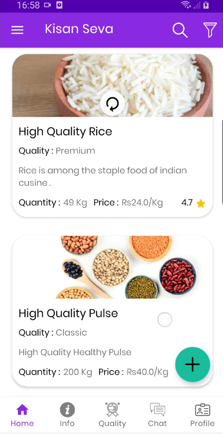 | 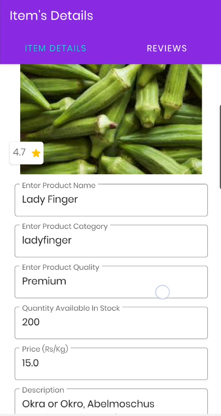 | 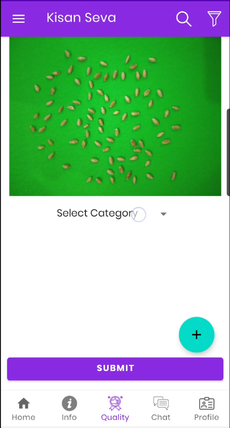 |
|:---:|:---:|:---:|
| Farmer's Inventory | Add Crops to sell | Crop Quality Prediction |

| 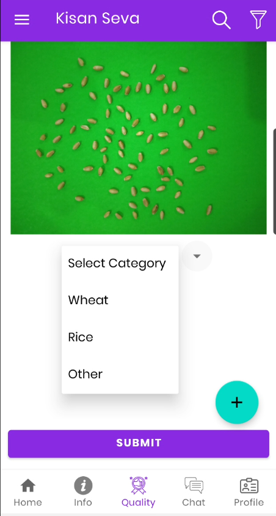 | 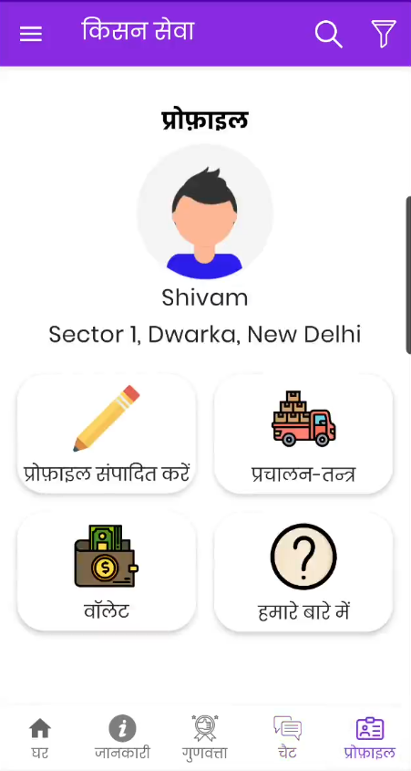 | 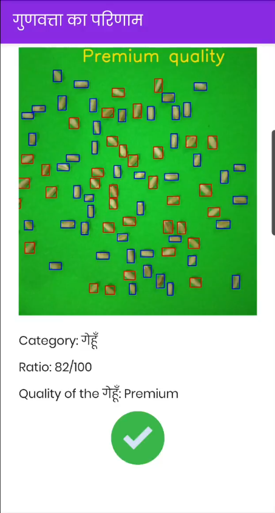 |
|:---:|:---:|:---:|
| Wheat/Rice Quality | Farmer's Profile | Predicted Quality By ML model |

| 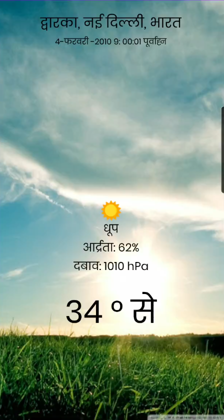 | 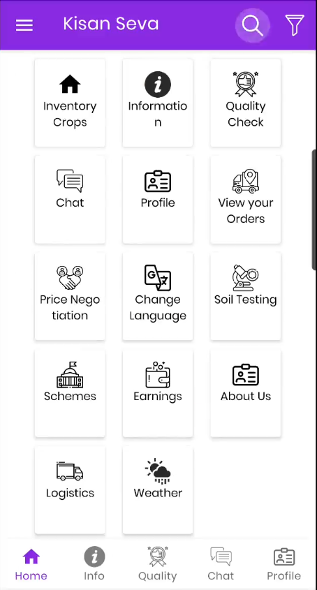 | 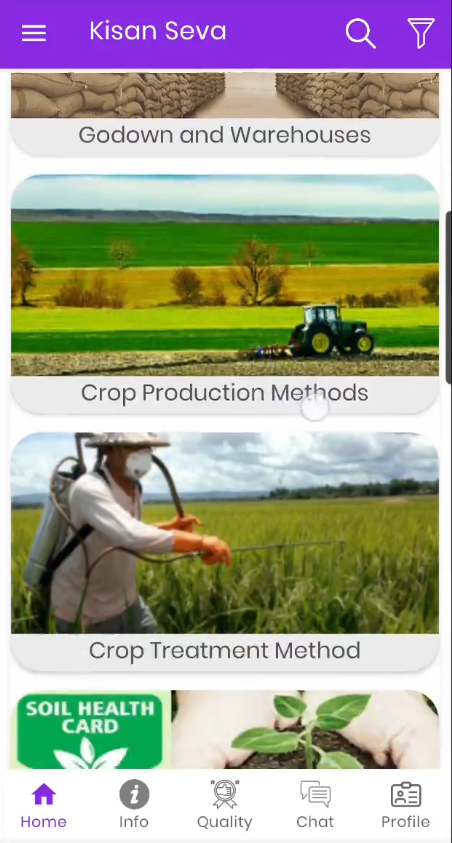 |
|:---:|:---:|:---:|
| Weather Updates | Search a feature | Information Section |

| 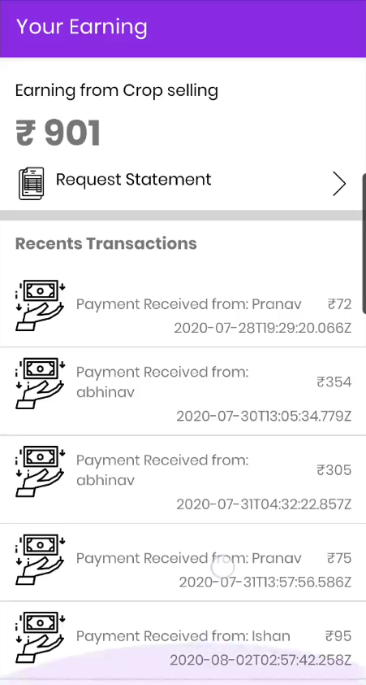 | 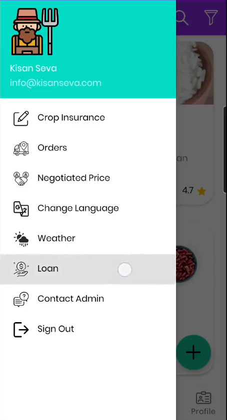 | 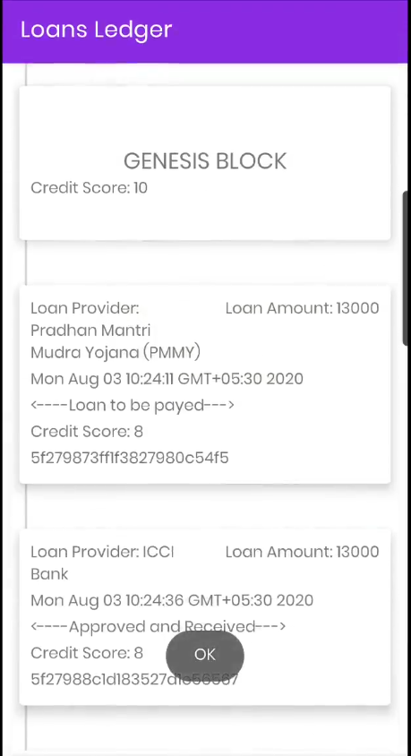 |
|:---:|:---:|:---:|
| Farmer's Earning Wallet | Navigation Drawer Options | Loan Ledger |

| 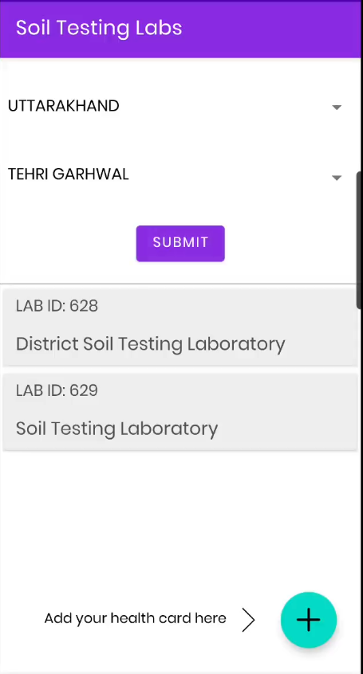 | 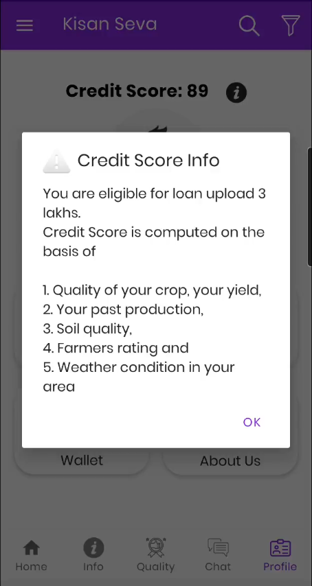 | 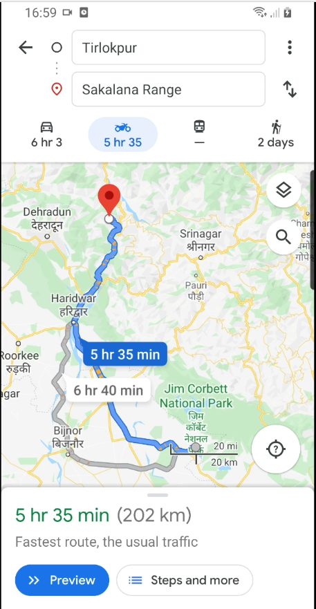 |
|:---:|:---:|:---:|
| Soil Testing Labs | Farmer's Credit Score | Maps to connect buyer/seller |


<!-- GETTING STARTED -->
## Getting Started

 Cloning from github
```sh
git clone https://github.com/SIH-20/KisanSeva-SmartIndiaHackathon.git
cd KisanSeva-SmartIndiaHackathon
```

If Android SDK and Android NDK are already installed you can install this application to the connected android device or emulator with:
```sh
./gradlew installDebug
```


<!-- CONTRIBUTING -->
## Contributing

For contributing to this project do follow the below steps. Any contributions you make are **greatly appreciated**.

1. Fork the Project
2. Create your Feature Branch (`git checkout -b feature/AmazingFeature`)
3. Commit your Changes (`git commit -m 'Add some AmazingFeature'`)
4. Push to the Branch (`git push origin feature/AmazingFeature`)
5. Open a Pull Request


<!-- LICENSE -->
## License

Distributed under the MIT License. See `LICENSE` for more information.


<!-- CONTACT -->
## Contact
Shivam Kumar - [@shivamkumard107](https://www.linkedin.com/in/shivam-kumar-a9aa96131/) - shivam.kumard107@gmail.com

Complete Project Link: [https://github.com/SIH-20/NC_GEU_MK100_Codeline](https://github.com/SIH-20/NC_GEU_MK100_Codeline)


<!-- ACKNOWLEDGEMENTS -->
## Acknowledgements
* [Smart India Hackathon](https://www.sih.gov.in/)
* [Pranav Sharma](https://github.com/pragmatist-strategist)
* [Mohit Ranjan](https://github.com/MohitR1999)
* [Flaticons](https://www.flaticon.com/)


<!-- MARKDOWN LINKS & IMAGES -->
<!-- https://www.markdownguide.org/basic-syntax/#reference-style-links -->
[contributors-shield]: https://img.shields.io/github/contributors/shivamkumard107/KisanSeva2.svg?style=flat-square
[contributors-url]: https://github.com/shivamkumard107/KisanSeva2/graphs/contributors
[forks-shield]: https://img.shields.io/github/forks/shivamkumard107/KisanSeva2.svg?style=flat-square
[forks-url]: https://github.com/shivamkumard107/KisanSeva2/network/members
[stars-shield]: https://img.shields.io/github/stars/shivamkumard107/KisanSeva2.svg?style=flat-square
[stars-url]: https://github.com/shivamkumard107/KisanSeva2/stargazers
[issues-shield]: https://img.shields.io/github/issues/shivamkumard107/KisanSeva2.svg?style=flat-square
[issues-url]: https://github.com/shivamkumard107/KisanSeva2/issues
[license-shield]: https://img.shields.io/github/license/shivamkumard107/KisanSeva2.svg?style=flat-square
[license-url]: https://github.com/shivamkumard107/KisanSeva2/blob/master/LICENSE
[linkedin-shield]: https://img.shields.io/badge/-LinkedIn-black.svg?style=flat-square&logo=linkedin&colorB=555
[linkedin-url]: https://www.linkedin.com/in/shivam-kumar-a9aa96131/
[product-screenshot]: images/icon.svg
